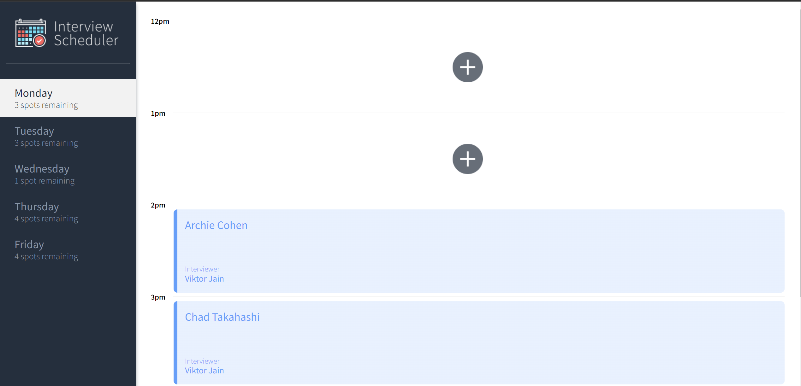
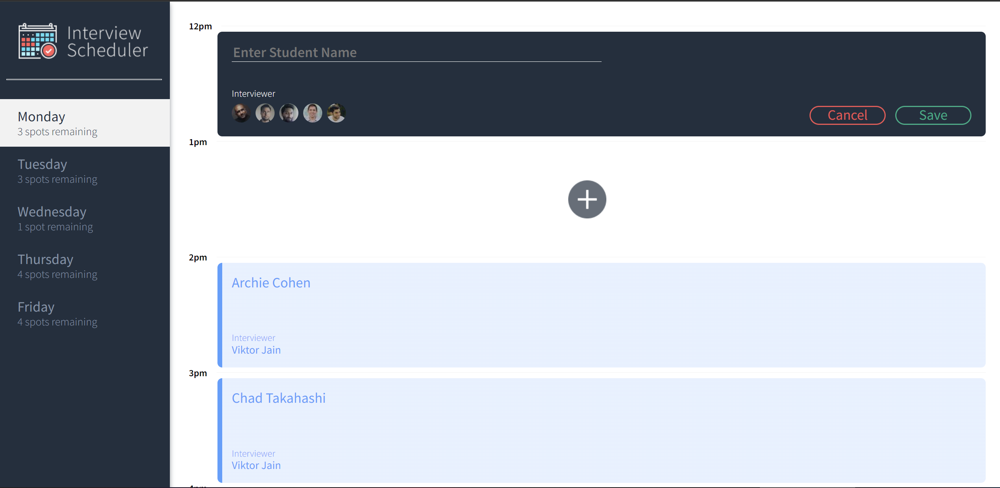
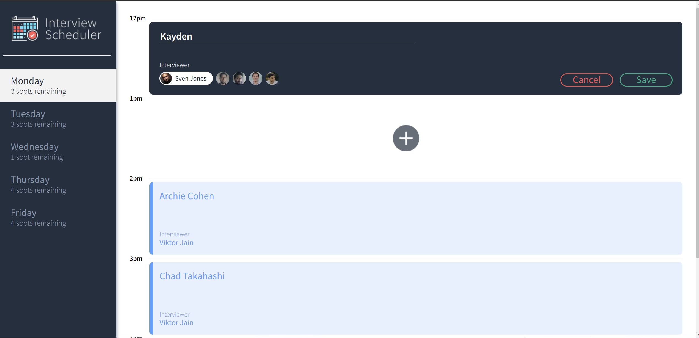
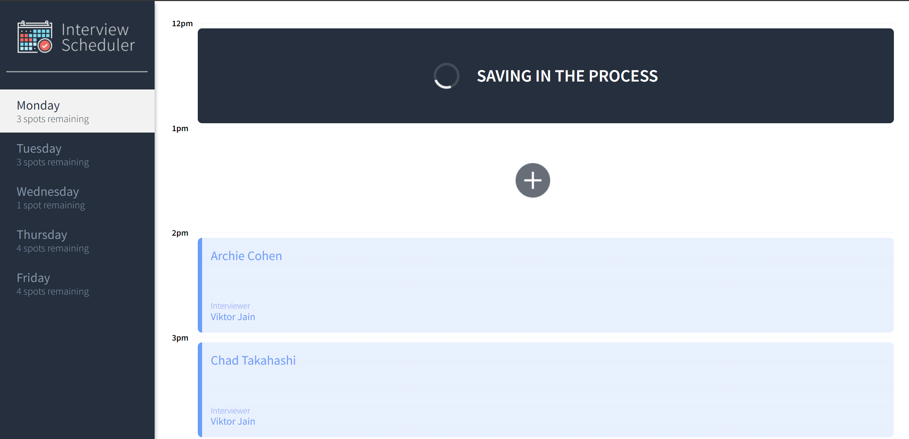
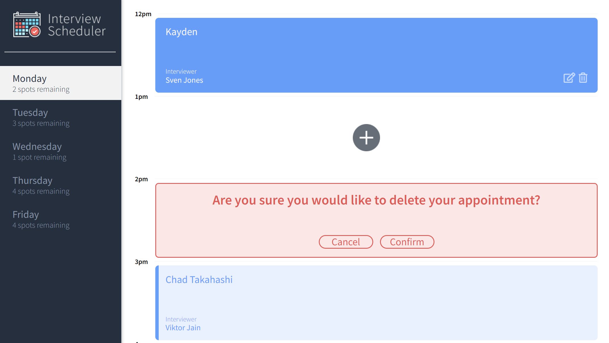
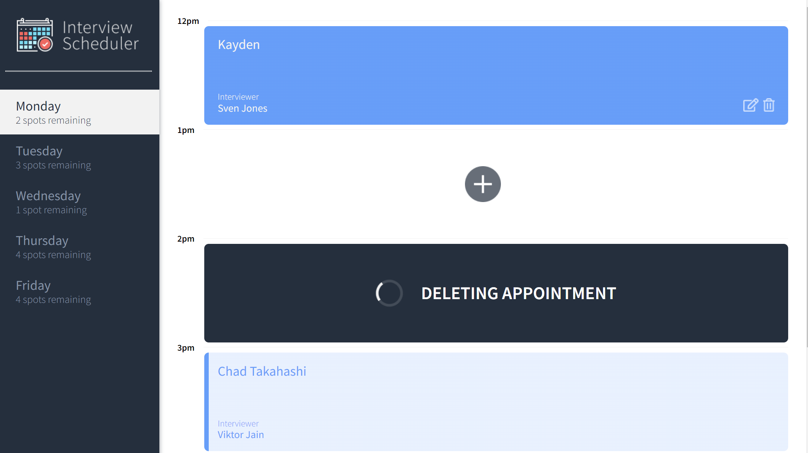

# Interview Scheduler

A React project from Lighthouse Labs Web Development Bootcamp.

This app provides a weekly calendar where you can select one of the available time slots and interviewer and book an interview.
It's also possible to edit and delete existing interviews.

## Setup

Fork this repository, then clone your fork of this repository.
Install dependencies with `npm install`.

To setup a database server, please visit: https://github.com/iKayden/scheduler-api

<hr>

## Running Webpack Development Server

```sh
npm start
```

## Running Jest Test Framework

```sh
npm test
```

## Running Storybook Visual Testbed

```sh
npm run storybook
```

## Running Cypress Test Framework

```sh
npm run cypress
```

## Dependencies

React
Node 5.10.x or above
Axios
React-dom
Cypress

## Technical Specifications

- React
- Webpack, Babel
- Axios
- Storybook, Webpack Dev Server, Jest, Testing Library
- PostgreSQL
- Cypress

# Visual Story

- This is the way the Scheduler looks at the first glance.
  
- We can add an appointment to any free spot
  

- We can write down you name and choose an interviewer, it can be edited later! (Validation is present)
  

- As soon as we are done with our appointment we can save it to our database.
  
- Whenever it saved it will be displayed. If we hover over we will see extra options. One of them is to delete an appointment.
  
- After we confirmed our cancellation we will see an animation with the process! 

<hr>
### Made by [Kayden](https://github.com/iKayden)
